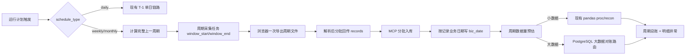

# 周期运行计划与大数据对账链路设计

## 背景

当前运行计划支持 `daily`、`weekly`、`monthly` 调度方式，但实际采集和对账日期仍按单日 `biz_date` 执行。这个口径适合每日 T-1 自动对账，不适合每周、每月运行计划。

周/月运行计划如果继续按单日执行，会让用户误以为系统完成了完整周/月对账。若把周/月拆成多个单日浏览器采集，又会显著放大千牛、淘宝等浏览器采集的登录次数、页面操作次数和风控概率。浏览器采集本身不稳定，周/月周期必须尽量减少浏览器会话和导出次数。

同时，周期数据量比日数据量大得多。当前浏览器采集、入库、读取、proc 和 recon 链路存在全量内存处理点，不能简单地把 `biz_date = 某一天` 改为 `biz_date between period_start and period_end` 后直接进入 pandas 全量对账。

## 已确认业务口径

- `daily`：保持现有单日 T-1 采集和对账逻辑。
- `weekly`：运行计划触发时对账完整上一个自然周，周一 00:00:00 到周日 23:59:59。
- `monthly`：运行计划触发时对账完整上一个自然月，1 日 00:00:00 到月末 23:59:59。
- 周/月浏览器采集不拆成每日采集。每个数据集在周期内只创建一个周期采集任务，浏览器会话内设置周期日期范围并导出一次。
- 对账结果同时需要周期总账和明细级逐笔异常。

## 当前性能评估

本设计基于当前代码路径和本地基准测试得出以下判断。

真实本地数据规模：

- 当前最大浏览器单日采集文件约 17,453 行。
- 最大收支明细 CSV 约 17,024 行，文件约 6.2MB。
- `browser_collection_records` 当前约 62,345 行。
- 单条浏览器采集 payload 平均约 662B。

文件解析基准：

- CSV 解析较快，20 万行约 17.4MB，读取约 1 秒。
- XLSX 解析明显较慢，5 万行读取约 15.5 秒，10 万行读取约 32 秒，进程内存峰值接近 500MB。

浏览器结果回传估算：

- 5 万行 records JSON 约 10MB。
- 10 万行约 20MB。
- 20 万行约 40MB。
- 50 万行约 100MB，单进程内存峰值接近 900MB。

recon pandas merge 基准：

- 5 万行 vs 5 万行，简化 outer merge 约 6.6 秒。
- 10 万行 vs 10 万行，约 13 秒。
- 20 万行 vs 20 万行，约 27.5 秒。
- 该基准不包含复杂 proc、多规则、多字段比较、异常明细 Excel 完整写出。

结论：

- 当前日频链路已验证 1.7 万行级别单日浏览器采集。
- 周频如果总量在 2 万到 5 万行，当前 pandas 路由大概率可支撑。
- 月频如果总量在 5 万行以内，可以先走现有 pandas 路由。
- 5 万到 10 万行属于可试但需记录性能指标的边界区。
- 10 万行以上不能直接承诺 pandas 全量对账稳定。
- 20 万行以上不应直接进入现有 pandas + Excel 全量输出链路。

## 设计目标

1. 周/月运行计划按完整上一自然周/月执行，避免用户误解为单日对账。
2. 日频单日链路保持兼容，不改变现有 T-1 行为。
3. 周/月浏览器采集只做周期采集，不拆成多个每日浏览器任务。
4. 浏览器采集结果支持分批回传、分批入库，避免单条 WebSocket/MCP 消息过大。
5. 周/月记录按每条明细自身业务日期落库，支持周期区间读取和明细异常定位。
6. 周/月对账根据数据量路由到小数据 pandas 路由或 PostgreSQL 大数据路由。
7. 对账输出同时包含周期总账和明细级异常。

## 非目标

- 不引入 DuckDB 作为第一版依赖。
- 不把周/月拆成多个每日浏览器采集任务。
- 不把所有 proc DSL 一次性 SQL 化。
- 不改变 daily 运行计划的现有数据日期行为。
- 不承诺现有 pandas 路由可稳定处理几十万行月度明细。

## 核心字段与语义

现有 `schedule_type` 已经表达调度方式，不新增 `period_type`。

`period_label` 不是核心字段。展示层可以根据 `schedule_type + period_start + period_end` 计算，例如 `2026-W22` 或 `2026-05`。第一版不需要单独入库该字段。

核心周期字段：

- `period_start`：业务周期开始日期，日期粒度即可，例如 `2026-05-01`。
- `period_end`：业务周期结束日期，例如 `2026-05-31`。
- `window_start`：采集窗口开始时间，可复用 `sync_jobs.window_start`。
- `window_end`：采集窗口结束时间，可复用 `sync_jobs.window_end`。
- `biz_date`：继续作为单日兼容字段；周/月不使用单个 `biz_date` 表达周期真实范围。

`browser_collection_records.biz_date` 在周/月采集下必须写每条记录自身业务日期，不写周期结束日。

## 总体架构



## 调度与周期解析

调度器触发运行计划时根据 `schedule_type` 生成运行上下文。

Daily：

- `biz_date = trigger_date - 1 day`，保持现状。
- 不设置周期路由标记。

Weekly：

- 触发日期所在周之前的完整自然周作为对账周期。
- 如果触发日为 2026-06-03，则周期为 2026-05-25 至 2026-05-31。

Monthly：

- 触发日期所在月之前的完整自然月作为对账周期。
- 如果触发日为 2026-06-03，则周期为 2026-05-01 至 2026-05-31。

运行上下文应包含：

```json
{
  "schedule_type": "weekly",
  "period_start": "2026-05-25",
  "period_end": "2026-05-31",
  "window_start": "2026-05-25 00:00:00",
  "window_end": "2026-05-31 23:59:59"
}
```

## 浏览器周期采集

### Playbook 参数

浏览器 playbook 增加日期范围参数支持：

- `period_start`
- `period_end`
- `window_start`
- `window_end`

日期控件仍由 playbook 声明如何填写，runner 只负责把参数传入。

### 记录业务日期

每个浏览器数据集必须声明业务日期字段：

- 订单：例如 `订单付款时间`。
- 收支明细：例如 `确认收货时间`、`打款时间`，以该数据集绑定配置为准。

解析文件后，browser-agent 需要从每条 payload 中提取业务日期，规范为 `YYYY-MM-DD`，写入 record envelope：

```json
{
  "item_key": "...",
  "item_key_values": {},
  "biz_date": "2026-05-28",
  "payload": {}
}
```

如果某条记录无法解析业务日期：

- 不应默默写入周期结束日。
- 该记录进入 invalid sample 统计。
- 如果 invalid 数量超过配置阈值，采集任务失败，避免周期对账口径错误。

### 分批回传

现有完成事件一次性携带所有 records。周期改造后拆成两个阶段：

1. `browser_sync_job_append_records`
   - 参数：`sync_job_id`、`batch_index`、`records`、`batch_record_count`。
   - 每批建议 2,000 到 5,000 行。
   - 服务端按 `sync_job_id + batch_index` 记录批次状态，重复批次幂等。

2. `browser_sync_job_complete`
   - 不再携带全量 records。
   - 只携带 summary、capture_files、总行数、批次数、业务日期覆盖范围。

回传失败后，browser-agent 可以重发失败批次。MCP 侧以记录 upsert 和批次幂等防重复。

### 分批入库

`upsert_browser_collection_records` 需要支持每条 record 自带 `biz_date`。原有 daily 调用可以继续传公共 `biz_date`，作为兼容兜底。

批量入库仍可使用 `execute_values page_size=1000`，但每个 append 批次只构建一个小批次 `values`，避免一次性构造几十万行内存对象。

### 周期 scoped finalize

周期重跑后需要清理本周期内旧记录，避免残留。

完成时执行 scoped finalize：

- 范围限定：`company_id + dataset_id + resource_key + period_start <= biz_date <= period_end`。
- 保留：`latest_seen_job_id = 当前 sync_job_id` 的记录。
- 其他 active 记录标记为 `deleted`。

Finalize 的风险是误删，因此必须使用周期范围、数据集、resource_key、公司维度同时限定，不允许只按 data_source 或 shop 粗范围删除。

## 区间读取

dataset loader 增加周期查询参数：

- `period_start`
- `period_end`

读取规则：

- daily：沿用 `biz_date = ?`。
- weekly/monthly：使用 `biz_date >= period_start AND biz_date <= period_end`。

需要支持的存储：

- `browser_collection_records`
- `dataset_collection_records`
- `platform_order_lines`
- `platform_alipay_bill_lines`

现有浏览器索引：

```text
(company_id, data_source_id, dataset_id, biz_date, record_status)
```

该索引可服务周期范围查询，但第一版实现后应通过 `EXPLAIN` 验证常见查询计划。若查询计划不理想，再补更贴合的组合索引。

## 对账执行路由

周/月对账不能无条件全量进入 pandas。执行前先统计左右输入数据量。

小数据路由：

- 适用：周期内左右总量在 5 万行以内。
- 执行：沿用现有 proc/recon pandas 链路。
- 输出：沿用现有 Excel 结果和异常入库逻辑，并增加周期总账字段。

边界数据路由：

- 适用：5 万到 10 万行。
- 执行：允许走 pandas，但必须记录耗时、内存估算、输入行数、输出异常数。
- 后续可根据真实运行结果调整阈值。

大数据路由：

- 适用：超过 10 万行，或配置强制走大数据路由。
- 执行：使用 PostgreSQL 中间表和 SQL join，不把全部数据拉进 Python pandas。
- 不引入 DuckDB 作为第一版依赖。

## PostgreSQL 大数据对账路由

第一版大数据路由优先覆盖当前订单/收支明细资金对账这类标准规则。

流程：

1. 读取 recon 规则和运行计划绑定。
2. 从 JSONB payload 中抽取规则需要字段，写入运行级中间表。
3. 中间表至少包含：
   - `run_id`
   - `side`
   - `biz_date`
   - `recon_key`
   - `amount`
   - `compare_payload`
   - `source_record_ref`
4. 对 `run_id, side, recon_key` 建临时索引。
5. 用 SQL 做 full outer join。
6. 生成周期总账：
   - 左侧笔数、右侧笔数
   - 左侧金额、右侧金额
   - 差额
   - 匹配数
   - 左独有、右独有、金额差异数
7. 异常明细落入运行异常表或专用明细表，前端分页读取。

SQL 路由不需要支持所有 proc DSL。若某方案的 proc 规则无法 SQL 化，则不能强行进入大数据路由，应提示该方案暂不支持大数据周期对账，并建议降低周期或先做规则适配。

## 周期总账与明细异常

周期总账用于判断整周期是否平衡：

- 左侧总笔数
- 右侧总笔数
- 左侧总金额
- 右侧总金额
- 金额差额
- 匹配率
- 异常总数

明细异常继续保持逐笔定位：

- `source_only`
- `target_only`
- `matched_with_diff`

每条异常应保留：

- `period_start`
- `period_end`
- `biz_date`
- `recon_key`
- 左右侧金额和关键字段
- 原始记录引用或 payload 摘要

## 前端展示

运行计划列表：

- 调度方式继续展示每日、每周、每月。
- 对账日期字段调整为对账期间：
  - daily 显示单日。
  - weekly/monthly 显示 `period_start 至 period_end`。

运行详情：

- 展示周期总账。
- 展示采集文件、行数、批次数、业务日期覆盖范围。
- 异常明细分页展示，不一次性渲染所有异常。

导出：

- 小数据可继续导出单个 Excel。
- 大数据导出优先导出异常明细，不导出全部匹配明细。
- 异常行数很大时按 sheet 或文件分片。

## 风险

### 浏览器风控风险

周期采集只打开一次浏览器，但页面生成报表时间更长，文件更大，仍可能触发超时或风控。需要保留人工接管和失败重试能力。

### 平台日期范围限制

千牛/淘宝页面可能限制最大日期范围或最大导出行数。playbook 需要识别导出失败、超出范围、报表未生成等页面状态。不能静默拆成大量单日浏览器任务。

### 业务日期解析风险

周/月文件内记录跨多天。每条记录必须解析自身业务日期。如果日期字段配置错误，周期读取和异常归属都会错误。

### 分批幂等风险

批次重发可能导致重复入库。需要批次幂等和记录 upsert 同时兜底。

### Scoped finalize 误删风险

周期重跑后清理旧记录是必要的，但如果范围条件错误会误删其他数据。Finalize 必须严格限定 company、dataset、resource_key 和日期区间。

### PostgreSQL 负载风险

大数据路由会把 join 和聚合压力放到 PostgreSQL。需要限制并发、记录耗时，并避免在高峰期并行跑多个大周期任务。

### 规则适配风险

现有 proc DSL 很灵活，不能假设所有规则都能 SQL 化。大数据路由第一版只覆盖标准资金对账规则，其他规则继续走 pandas 或提示不支持大周期。

### Excel 输出风险

Excel 写出是当前瓶颈之一。异常很多时写 xlsx 会慢，超过单 sheet 行数限制时会失败。大数据路由需要分页或分文件导出。

## 测试计划

1. daily 运行计划仍按 T-1 单日执行，request payload 和对账结果不变化。
2. weekly 运行计划计算完整上一自然周。
3. monthly 运行计划计算完整上一自然月。
4. 周/月浏览器采集只创建一个 sync_job，并设置 `window_start/window_end`。
5. browser-agent 分批发送 records，MCP 分批入库后总行数正确。
6. 批次重复发送不会产生重复记录。
7. 周/月记录按自身业务日期写入 `browser_collection_records.biz_date`。
8. 周期 scoped finalize 只删除当前 dataset/resource/period 范围内未被当前 job 看到的旧记录。
9. dataset loader daily 查询仍使用 `biz_date = ?`。
10. dataset loader 周/月查询使用 `period_start/period_end` 区间。
11. 5 万行以内周期数据可走 pandas 路由并输出周期总账和明细异常。
12. 超过阈值的数据进入 PostgreSQL 大数据路由或给出明确不支持原因。
13. 大数据路由输出周期总账和分页异常明细。
14. 业务日期字段缺失或解析失败时，采集任务失败并给出字段错误提示。

## 分阶段实施建议

### 第一阶段：周期语义与分批采集

- 调度器生成 weekly/monthly 周期范围。
- 浏览器 playbook 支持日期范围参数。
- browser-agent 分批回传。
- MCP 分批入库，支持 record-level `biz_date`。
- dataset loader 支持区间读取。

### 第二阶段：小数据周期对账

- 周/月小数据走现有 pandas proc/recon。
- 增加周期总账汇总。
- 前端展示对账期间和周期汇总。

### 第三阶段：PostgreSQL 大数据路由

- 标准资金对账规则适配 SQL 中间表。
- 输出周期总账和分页异常明细。
- 大数据导出按异常分页或分文件。

### 第四阶段：容量校准

- 使用真实店铺周/月数据压测。
- 校准 pandas 路由阈值。
- 校准 PostgreSQL 大数据路由并发和查询索引。
